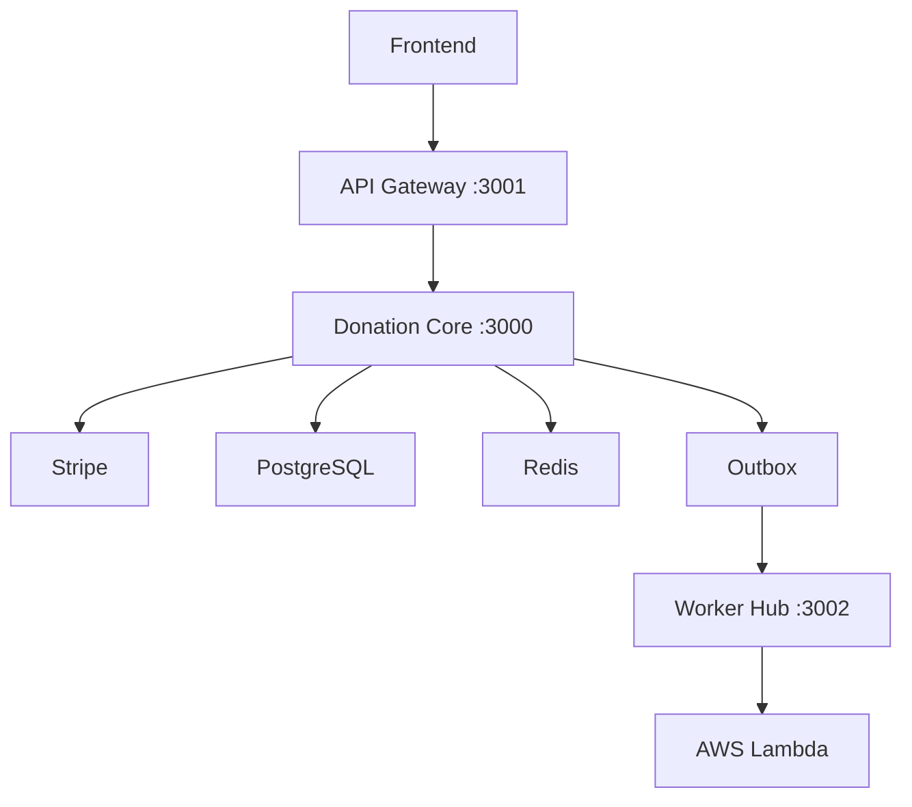

# Donation Core API

Microservices Architecture for Transparent Donations | NestJS, Stripe, Clean Architecture, Terraform & AWS ECS

[](https://github.com/your-username/donation-core-api/actions/workflows/deploy.yml)
[](https://opensource.org/licenses/MIT)

## 📋 About

This project implements a microservices architecture for transparent donation management. It provides a clean, scalable solution for NGOs to receive donations through Stripe, with full traceability and outbox pattern for event-driven processing.

## 🏗️ Architecture



### Services

- **API Gateway**: Backend for Frontend (BFF) that orchestrates requests
- **Donation Core**: Core business logic, Stripe integration, and database operations
- **Worker Hub**: Event processing and AWS Lambda integration for impact reports

## 🚀 Features

### Backend (NestJS + Prisma)
- ✅ Stripe payment integration
- ✅ Outbox pattern for reliable event processing
- ✅ Clean Architecture with SOLID principles
- ✅ PostgreSQL with Prisma ORM
- ✅ Redis/BullMQ for job queues

### DevOps & Infrastructure (Terraform + AWS)
- ✅ AWS ECS deployment
- ✅ RDS PostgreSQL database
- ✅ ElastiCache Redis
- ✅ ECR container registry
- ✅ Application Load Balancer
- ✅ GitHub Actions CI/CD

### Developer Experience
- ✅ Docker Compose for local development
- ✅ Comprehensive test suite (Jest)
- ✅ Swagger/OpenAPI documentation
- ✅ New Relic monitoring
- ✅ Correlation ID tracing

## 🛠️ Tech Stack

- **Framework**: NestJS v11
- **Database**: PostgreSQL with Prisma v6
- **Cache/Queue**: Redis with BullMQ
- **Payments**: Stripe
- **Infrastructure**: Terraform, AWS ECS/RDS/ECR
- **CI/CD**: GitHub Actions
- **Monitoring**: New Relic
- **Containerization**: Docker & Docker Compose
- **Package Manager**: pnpm

## 📦 Installation

### Prerequisites

- Node.js 20+
- pnpm
- Docker & Docker Compose
- Terraform (for infrastructure)
- AWS CLI (for deployment)

### Local Development Setup

1. **Clone the repository**
   ```bash
   git clone https://github.com/your-username/donation-core-api.git
   cd donation-core-api
   ```

2. **Install dependencies**
   ```bash
   pnpm install
   ```

3. **Environment Configuration**
   ```bash
   cp .env.example .env
   # Edit .env with your local configuration
   ```

4. **Start the services**
   ```bash
   docker compose up --build
   ```

   This will start:
   - PostgreSQL on port 5432
   - Redis on port 6379
   - API Gateway on port 3001
   - Donation Core on port 3000 (with automatic migrations and seed if RUN_SEED=true)
   - Worker Hub on port 3002

5. **(Optional) Run database migrations manually**
   ```bash
   pnpm --filter donation-core prisma migrate dev
   ```

6. **(Optional) Seed the database manually**
   ```bash
   pnpm --filter donation-core prisma db seed
   ```

## 🧪 Testing

### Run All Tests
```bash
pnpm test
```

### Run Tests for Specific Service
```bash
# API Gateway
pnpm --filter api-gateway test

# Donation Core
pnpm --filter donation-core test

# Worker Hub
pnpm --filter worker-hub test
```

### End-to-End Tests
```bash
pnpm test:e2e
```

### Test Coverage
```bash
pnpm test:cov
```

## 📚 API Documentation

Once running locally, access Swagger documentation at:
- **API Gateway**: http://localhost:3001/api

## 🚀 Deployment

### Automatic Deployment
Push to the `main` branch triggers CI/CD pipeline that:
1. Runs all tests
2. Builds Docker images
3. Pushes to AWS ECR
4. Deploys to ECS

### Manual Deployment

1. **Infrastructure Setup**
   ```bash
   cd terraform
   terraform init
   terraform plan
   terraform apply
   ```

2. **Environment Variables**
   Configure the following in your deployment environment:
   - `DATABASE_URL`
   - `REDIS_URL`
   - `STRIPE_SECRET_KEY`
   - `STRIPE_WEBHOOK_SECRET`
   - And other service-specific variables

## 🤝 Contributing

We welcome contributions! This is an open-source project and we encourage community involvement.

### How to Contribute

1. Fork the repository
2. Create a feature branch: `git checkout -b feature/amazing-feature`
3. Make your changes following our [Contributing Guidelines](CONTRIBUTING.md)
4. Run tests: `pnpm test`
5. Commit your changes: `git commit -m 'Add amazing feature'`
6. Push to the branch: `git push origin feature/amazing-feature`
7. Open a Pull Request

### Areas for Contribution

#### Backend (NestJS + Prisma)
- **Webhooks Implementation**: Create system to notify external systems when donations are confirmed
- **New Payment Gateways**: Add integration with PayPal or local methods (e.g., MB WAY)
- **Reporting System**: Generate PDF/CSV exports of donations by period
- **Advanced Validations**: Implement CPF/NIF validation and basic fraud filters

#### DevOps & Infrastructure (Terraform + AWS)
- **Multi-Cloud Support**: Adapt Terraform for Google Cloud (GCP) or Azure
- **HTTPS Configuration**: Create `aws_acm_certificate` resource and automate DNS validation
- **Enhanced CI/CD**: Improve GitHub Actions with more comprehensive testing and deployment strategies
- **Monitoring**: Set up CloudWatch dashboards or integrate Prometheus/Grafana

#### Developer Experience (DX)
- **API Documentation**: Enhance Swagger/OpenAPI with detailed examples and interactive testing
- **Docker Compose Improvements**: Add "seeds" profile for populating database with fake data
- **Testing Coverage**: Increase unit and integration test coverage with Jest
- **Internationalization**: Prepare system for multi-language support in error messages and emails

#### Stability & Reliability
- **Outbox Improvements**: Implement exponential backoff strategy for failed event retries
- **Structured Logging**: Add Winston or Pino for JSON-structured logs
- **Error Handling**: Enhance error boundaries and recovery mechanisms
- **Performance**: Optimize database queries and add caching layers

### Good First Issues
Look for issues labeled `good first issue` to start contributing:
- [API Documentation improvements](https://github.com/your-username/donation-core-api/issues)
- [Unit test additions](https://github.com/your-username/donation-core-api/issues)
- [Docker Compose enhancements](https://github.com/your-username/donation-core-api/issues)

## 📄 License

This project is licensed under the MIT License - see the [LICENSE](LICENSE) file for details.

## 🙏 Acknowledgments

- Built with ❤️ for transparent and efficient donation management
- Thanks to all contributors and the open-source community

## 📞 Support

If you have questions or need help:
- Open an [issue](https://github.com/your-username/donation-core-api/issues)
- Check our [Contributing Guidelines](CONTRIBUTING.md)
- Review the [API Documentation](http://localhost:3001/api) when running locally