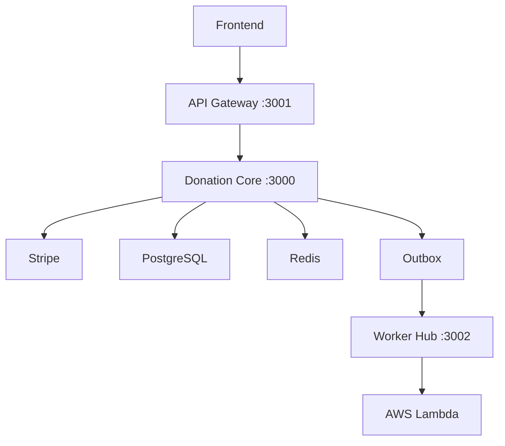

# Donation Core API

Microservices Architecture for Transparent Donations | NestJS, Stripe, Clean Architecture, Terraform & AWS ECS

## Architecture

## Tech Stack

- NestJS
- Prisma (PostgreSQL)
- Redis/BullMQ
- Stripe
- Docker
- Terraform (AWS ECS)
- New Relic

## How to Run Locally

1. Clone the repo
2. Copy `.env.example` to `.env` and fill with your values
3. Run `docker compose up --build`

## API Documentation

Swagger available at `http://localhost:3001/api`

## Tests

Run `pnpm test` for all tests.

## Deploy

Push to `main` branch triggers CI/CD with GitHub Actions.